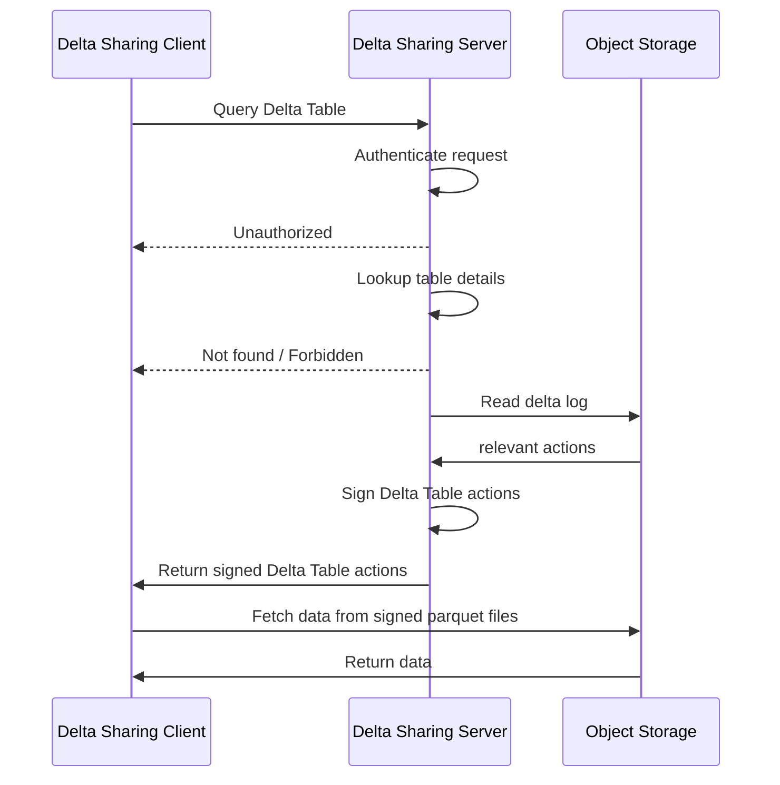

# Overview

The Delta Sharing Server first and foremost implements the Delta Sharing protocol. The protocol is a REST API that allows clients to discover and query Delta Tables. The server is responsible for authenticating requests, looking up table details, and creating signed URLs to the data files that contain the relevant table data.

The high level process of querying a Delta Table from a Delta Sharing Client is as follows:

The Delta Sharing Server is thus responsible for the following:

- Authentication of HTTP requests from Delta Sharing clients (i.e. recipients)
- Querying a repository of shared Delta tables with details including the location of the data files in (cloud) object storage
- Interacting with the object storage to replay the Delta log to find the data files for the requested table
- Generating signed URLs to the data files that contain the requested table data

The Delta Sharing Server has abstractions for these components that can be implemented to support different authentication mechanisms, storage backends, and table discovery strategies. These abstractions are defined using traits and can be implemented by users to customize the server to their needs.

The Delta Sharing Server is implemented in Rust and uses the [Axum](https://github.com/tokio-rs/axum) web framework for handling HTTP requests. The server is designed to be fast and efficient, and can be deployed as a standalone server or as a library in a larger application.
